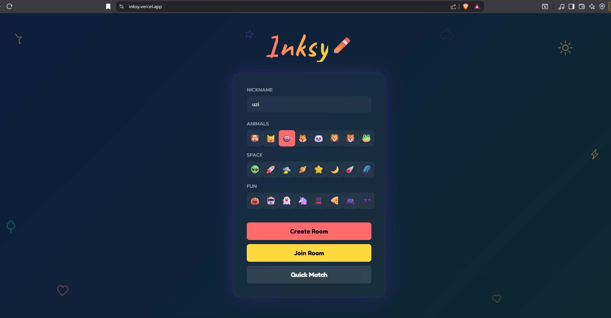
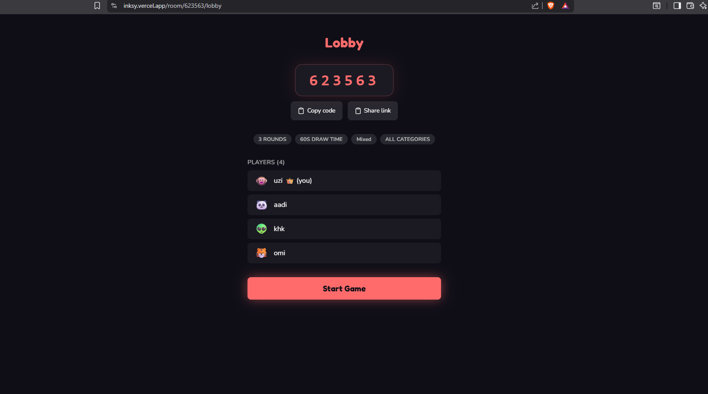
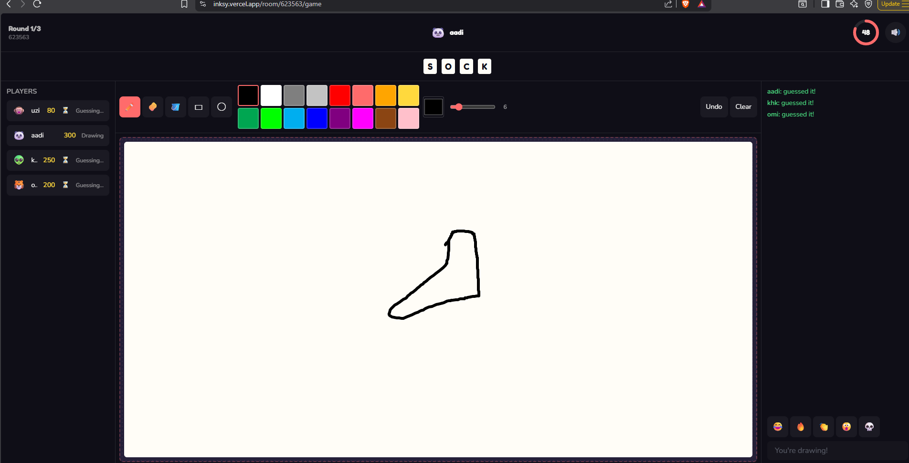
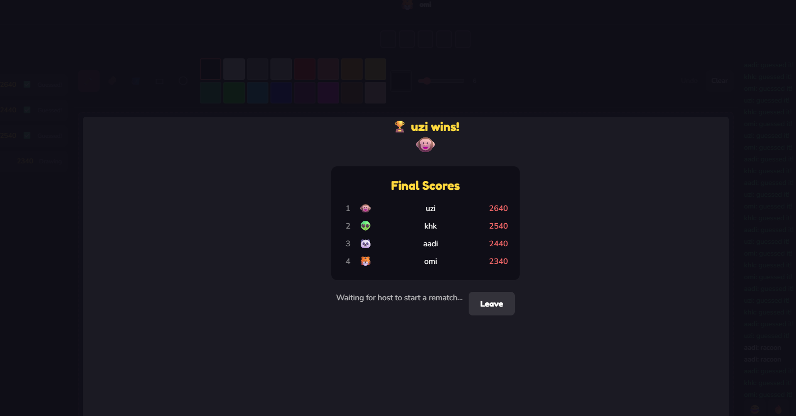

<div align="center">

# ✏️ Inksy

**A real-time multiplayer drawing & guessing game.**

One player draws, everyone else races to guess the word — built for quick, chaotic rounds with friends.

**[🎮 Play Now → inksy.vercel.app](https://inksy.vercel.app)**

</div>

---

## About

Inksy is a Pictionary-style party game: each round, one player is handed a secret word and draws it live on a shared canvas while everyone else guesses in chat. Points are awarded by how fast you guess, the drawer earns bonuses for guessers who get it right, and the game keeps going until the rounds run out — then the scoreboard (with proper tiebreaking) crowns a winner.

It's built as a full-stack real-time app: a server-authoritative game state machine drives rounds/turns/scoring, Socket.io keeps every client in sync, and the word is never sent to guessers' browsers — only the server ever knows it.

## Features

- 🎨 **Live drawing canvas** — pencil, eraser, shapes, fill bucket, undo/clear, all synced in real time across every player, including late joiners
- 📝 **Word guessing with categories** — pick from 13 categories (animals, food, movies, tech, superheroes, and more) or bring your own custom word pack
- 🏆 **Fair scoring with real tiebreaking** — points by guess speed/order, drawer bonuses, and a multi-level tiebreaker (guess count → average guess time → shared rank) so the final scoreboard is never ambiguous
- ⏱️ **Timed rounds** — configurable round count and draw time, with progressive word hints as the clock runs down
- 😄 **Reactions & sound** — emoji reactions during drawing, procedurally generated sound effects (correct-guess chime, tick, winner fanfare), fully mutable
- 📱 **Mobile-friendly** — touch-drawing support, keyboard-safe layout, tap targets sized for phones
- 🔢 **Simple 6-digit room codes** — create a room, share the code, done
- 🎉 **Confetti-worthy finishes** — animated scoreboard, medals, and a winner celebration screen

## Tech Stack

**Frontend**


**Backend**


**Deployment**


## Screenshots

| Home Screen | Lobby Screen |
|-------------|--------------|
|  |  |

| Game Screen | Winner Screen |
|-------------|---------------|
|  |  |

## Running Locally

### Prerequisites

- [Node.js](https://nodejs.org/) 18+
- A local [MongoDB](https://www.mongodb.com/try/download/community) instance (used for room/game state)
- A local [MySQL](https://dev.mysql.com/downloads/) instance (used for word lists & game history)

### 1. Clone and install

```bash
git clone https://github.com/umarzia-git/inksy.git
cd inksy
npm install
```

This installs both the `client` and `server` workspaces from the root.

### 2. Configure environment variables

```bash
cp server/.env.example server/.env
cp client/.env.example client/.env
```

Edit `server/.env` with your local MongoDB URI and MySQL credentials. The defaults (`mongodb://localhost:27017/inksy`, MySQL on `localhost:3306`) work out of the box for most local setups — just make sure both databases are running.

`client/.env` only needs `VITE_SERVER_URL=http://localhost:4000`, which is already the default.

### 3. Set up the database

```bash
node server/db/migrate.js      # creates MySQL tables (idempotent, safe to re-run)
node server/db/seed_words.js   # seeds the word list
```

### 4. Start the app

```bash
npm run dev
```

This boots both the client (`http://localhost:5173`) and server (`http://localhost:4000`) concurrently. Open the client URL, create a room, and open a second tab (or share your room code with a friend) to start playing.

## Deployment

Inksy is deployed as two separate services:

| Service | Platform | Notes |
|---|---|---|
| **Frontend** (`client/`) | [Vercel](https://vercel.com) | Project root directory set to `client/`; `client/vercel.json` handles SPA rewrites so client-side routes don't 404 on refresh |
| **Backend** (`server/`) | [Railway](https://railway.app) | Runs the Express + Socket.io server, connects to managed MongoDB and MySQL instances |

### Required environment variables

**Vercel (frontend)**

| Variable | Example |
|---|---|
| `VITE_SERVER_URL` | `https://inksy-production.up.railway.app` |

**Railway (backend)**

| Variable | Example |
|---|---|
| `CLIENT_URL` | `https://inksy.vercel.app` |
| `EXTRA_CORS_ORIGINS` | Optional, comma-separated extra allowed origins |
| `MONGO_URI` | Your MongoDB connection string |
| `MYSQL_HOST`, `MYSQL_PORT`, `MYSQL_USER`, `MYSQL_PASSWORD`, `MYSQL_DATABASE` | Your MySQL connection details |

After deploying or updating the word list, re-run the seed script against the production database:

```bash
node server/db/seed_words.js
```

---

<div align="center">


</div>
